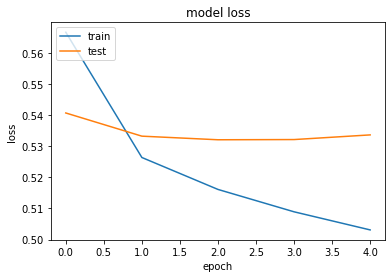

BookMark - Bright Bookshelf
====

Hanyang University, SE/AI project
---

---

### Quick links

> GUI mockups [(Figma)](https://www.figma.com/file/txDJQqtWLzodwYxILwvgNh/Bookshelf)
>
> UML [(draw.io)](https://drive.google.com/file/d/1qXDdPbP0vvrqVYIyJdMQ6C-DeG7IgjeZ/view?usp=sharing)
>
> Book Recommendation System Dataset [(Kaggle)](https://www.kaggle.com/fahadmehfoooz/book-recommendation-system/data)


> [YouTube presentation]([https://youtu.be/13PwAViGRXg         ](https://youtu.be/13PwAViGRXg))
>
> [YouTube demo (timestamp)](https://youtu.be/13PwAViGRXg?t=296)

---

### Contributors

This team has been created for a joint project between the Software Engineering (SE) and the Artificial Intelligence and Application (AI) courses in Hanyang University. The contributors of this project are:

- Mathilde Lærke Hansen, 9077620215, SE
  Department of Information Systems
- Sarah Schlegel, 9091820217, SE & AI
  Department of Computer Science
- Anais Zhang, 9088520214, SE & AI
  Department of Computer Science
- YoungHa Hwang, 2017029261, SE
  Department of Information Systems
- Laura Vikke Mårtensson, 9077020219, SE
  Department of Computer Science


---

I. Introduction
----

**Abstract**

*Nowadays, modern people (workers, students, etc.) lack time for reading books. Although they have motivation to read, the time for reading has low priority amongst the 24 hours of the day when people are investing time in various activities such as studying, working, or exercising. For example, even if you want to read a book, the hardships of choosing and purchasing a book yourself are an obstacle to reading.*

*Therefore, we created the application BookMark to overcome these difficulties. BookMark is meant to help the customers manage their bookshelf, either physical or digital, and arrange more time in their daily life to read. It provides a system of notifications and reminders to keep track of the books the user is currently reading. It makes the bookshelf management easier by using simple image recognition to search for a book by its cover or barcode or ISBN number, automatically sorting the content and providing different pairing options between physical copies, ebooks or audiobooks. By automatizing the usually difficult part of book management, BookMark wishes to let the reader make more space in his or her day to actually read.*


**Motivation**

The **BookMark** project comes from the observation that many people today don't have the time or the motivation to read new books as they navigate their fast paced and overstimulated everyday life. Our goal is to provide with this smart bookshelf and application a simpler way to manage the books people are reading, whether it's by swapping from the physical book to the audiobook, by reminding them to read at certain times or by recommending them new books based on their current preferences, or by recommending new books to the users.

In the AI part, we will mainly focus on the book management and suggestion. We will be building some prediction algorithms, based on graphs, schemes and statistics from existing libraries and APIs, to determine the closest books to be recommended to a specific user. In the end, we would like to create a good recommendation system for the user.

We would also like to include some image recognition libraries to scan the barcode or the ISBN number and recover the book data from that information, or to scan the book cover and search for the book from those informations. 


---

II. Dataset
---

The inputs for this study will be based on the Book Recommendation System project by Fahad Mehfooz [1] that can be found on Kaggle. This project feeds on three datasets : books, users and ratings. This data has also been used as the source for the BookMark database.

### a. Books dataset

The books dataset contains simple data about the books. The books are identified by their ISBN, and invalid ISBNs have already been removed from the dataset by the author. The additional information about each book (title, author, year of publication and publisher) has been extracted from Amazon. The dataset also contains links to the Amazon covers of each book in small, medium and large size. The dataset contains a total of 271 361 books.

<table border="1" class="dataframe">
  <thead>
    <tr style="text-align: right;">
      <th></th>
      <th>ISBN</th>
      <th>Book-Title</th>
      <th>Book-Author</th>
      <th>Year-Of-Publication</th>
      <th>Publisher</th>
      <th>Image-URL-L</th>
    </tr>
  </thead>
  <tbody>
    <tr>
      <th>0</th>
      <td>0195153448</td>
      <td>Classical Mythology</td>
      <td>Mark P. O. Morford</td>
      <td>2002</td>
      <td>Oxford University Press</td>
      <td>http://images.amazon.com/images/P/0195153448.0...</td>
    </tr>
    <tr>
      <th>1</th>
      <td>0002005018</td>
      <td>Clara Callan</td>
      <td>Richard Bruce Wright</td>
      <td>2001</td>
      <td>HarperFlamingo Canada</td>
      <td>http://images.amazon.com/images/P/0002005018.0...</td>
    </tr>
    <tr>
      <th>2</th>
      <td>0060973129</td>
      <td>Decision in Normandy</td>
      <td>Carlo D'Este</td>
      <td>1991</td>
      <td>HarperPerennial</td>
      <td>http://images.amazon.com/images/P/0060973129.0...</td>
    </tr>
    <tr>
      <th>3</th>
      <td>0374157065</td>
      <td>Flu: The Story of the Great Influenza Pandemic...</td>
      <td>Gina Bari Kolata</td>
      <td>1999</td>
      <td>Farrar Straus Giroux</td>
      <td>http://images.amazon.com/images/P/0374157065.0...</td>
    </tr>
    <tr>
      <th>4</th>
      <td>0393045218</td>
      <td>The Mummies of Urumchi</td>
      <td>E. J. W. Barber</td>
      <td>1999</td>
      <td>W. W. Norton &amp;amp; Company</td>
      <td>http://images.amazon.com/images/P/0393045218.0...</td>
    </tr>
  </tbody>
</table>


### b. Users dataset

The users dataset contains informations for the user's id, location and age. There is not much more to this dataset since we don't take into account the geographical location or the age of the user in our recommendation system. Also the age data in this dataset is quite uneven, not always available.

<table border="1" class="dataframe">
  <thead>
    <tr style="text-align: right;">
      <th></th>
      <th>User-ID</th>
      <th>Location</th>
      <th>Age</th>
    </tr>
  </thead>
  <tbody>
    <tr>
      <th>0</th>
      <td>1</td>
      <td>nyc, new york, usa</td>
      <td>NaN</td>
    </tr>
    <tr>
      <th>1</th>
      <td>2</td>
      <td>stockton, california, usa</td>
      <td>18.0</td>
    </tr>
    <tr>
      <th>2</th>
      <td>3</td>
      <td>moscow, yukon territory, russia</td>
      <td>NaN</td>
    </tr>
    <tr>
      <th>3</th>
      <td>4</td>
      <td>porto, v.n.gaia, portugal</td>
      <td>17.0</td>
    </tr>
    <tr>
      <th>4</th>
      <td>5</td>
      <td>farnborough, hants, united kingdom</td>
      <td>NaN</td>
    </tr>
  </tbody>
</table>


### c. Ratings dataset

The ratings dataset associates an ISBN and a user ID to a score expressed as an integer on a scale from 0 to 10, the highest value being 10. This dataset contains a total of 1 149 781 lines, from which we can isolate a total of 105 283 unique users and 340 556 unique book ISBNs. The ratings dataset will be the main dataset used for our project, as our collaborative filtering approach doesn't require more than IDs for both books and users. The users and books datasets are here to provide additional informations, especially about the books.

<table border="1" class="dataframe">
  <thead>
    <tr style="text-align: right;">
      <th></th>
      <th>userid</th>
      <th>ISBN</th>
      <th>bookrating</th>
    </tr>
  </thead>
  <tbody>
    <tr>
      <th>0</th>
      <td>276725</td>
      <td>034545104X</td>
      <td>0</td>
    </tr>
    <tr>
      <th>1</th>
      <td>276726</td>
      <td>0155061224</td>
      <td>5</td>
    </tr>
    <tr>
      <th>2</th>
      <td>276727</td>
      <td>0446520802</td>
      <td>0</td>
    </tr>
    <tr>
      <th>3</th>
      <td>276729</td>
      <td>052165615X</td>
      <td>3</td>
    </tr>
    <tr>
      <th>4</th>
      <td>276729</td>
      <td>0521795028</td>
      <td>6</td>
    </tr>
  </tbody>
</table>


---

III. Methodology
---

The approach we have chosen is a Collaborative Filtering algorithm. Collaborative filtering relies on the idea that if two users have a similar ranking of given items, they will probably act similarly in the future. Thus, if one of them likes something new, we can recommend it to the other and he will probably like it too. The advantage of collaborative filtering is that it doesn't need specific data about the items themselves, whether it's the books or the users, and it doesn't either have to process the content it is analyzing. Famous examples of collaborative filtering are movies and TV shows, as the collaborative filtering approach is for example a part of Netflix's recommendation algorithm, even though it is combined with many other approaches. On the contrary, content-based filtering only takes into account the data of a given user to compute recommendations.

In our case, the idea is to consider similarities between users and at the same time similarities between items (here the books) to provide recommendations.


Collaborative Filtering approach:

1. Map user ID to a "user vector" via an embedding matrix
2. Map book ID to a "book vector" via an embedding matrix
3. Compute the dot product between the user vector and book vector, to obtain the a match score between the user and the book (predicted rating).
4. Train the embeddings via gradient descent using all known user-book pairs.


### a. Libraries & Import

```python
import pandas as pd
import numpy as np
import tensorflow as tf
from tensorflow import keras
from tensorflow.keras import layers
from pathlib import Path
import matplotlib.pyplot as plt
import json
```


```python
# we are using the concanteted rating data (userid & isbn & bookrating) for training
book_df = pd.read_csv("Books.csv", names = ['ISBN', 'title', 'author', 'year_publication', 'publisher', 'img_s', 'img_m', 'img_l'], skiprows = 1)
users = pd.read_csv("Users.csv")
df = pd.read_csv("Ratings.csv", names = ['userid','ISBN', 'bookrating'], skiprows = 1)
df.head()
```


### b. Preprocessing

Before starting to train the dataset, we want to clear the data from all redundancies and isolate all unique features that will be used for identification, whether it is for the books or for the users. So first, we get a list of all the uniue user id's and book ISBNs, and then we remap the dataframe values with the isolated unique values.


```python
user_ids = df["userid"].unique().tolist() 
user2user_encoded = {x: i for i, x in enumerate(user_ids)} # map the unique user id's in sequence from 0 - n
userencoded2user = {i: x for i, x in enumerate(user_ids)}  # map the unique user id's from 0 - n (the other way around)

book_ids = df["ISBN"].unique().tolist()
book2book_encoded = {x: i for i, x in enumerate(book_ids)}
book_encoded2book = {i: x for i, x in enumerate(book_ids)}

df["user"] = df["userid"].map(user2user_encoded)
df["book"] = df["ISBN"].map(book2book_encoded)
```


Then, we normalize the data by getting the minimum and the maximum of the book ratings and we apply a lambda function to get all the ratings in a range between 0 and 1 for easier training. The training is then done on 80% of the data, and validated on 20%.


```python
num_users = len(user2user_encoded)
num_books = len(book_encoded2book)
min_rating = min(df["bookrating"])
max_rating = max(df["bookrating"])

df = df.sample(frac=1, random_state=42) # Shuffle the dataframe
x = df[["user", "book"]].values

# Normalize the targets between 0 and 1. Makes it easier to train.
y = df["bookrating"].apply(lambda x: (x - min_rating) / (max_rating - min_rating)).values

# Training on 80% of the data and validating on 20%.
train_indices = int(0.8 * len(df))
x_train, x_test, y_train, y_test = (
    x[:train_indices],
    x[train_indices:],
    y[:train_indices],
    y[train_indices:],
)
```


### c. Model & Training

For training the Collaborative filtering model, we will use the Keras library. The basic structure of the model consists of an initialization of the two embedding matrices: one for the users, and one for the books, as well as a bias vector for each matrix. We choose the embedding size, which will represent each user and book, to be 50. The embeddings are randomly initialized, and the sigmoid function are applied to each dot product in order to predict a rating between 0 and 1. The loss function used to calculate the distance between the predicted rating and the actual rating is binary cross-entropy, and the Adam optimizer algorithm is used to tune the embeddings through gradient descent.


```python
EMBEDDING_SIZE = 50 # Embeddings are vectors representing each book and user

class RecommenderNet(keras.Model): # Create subclass of Keras Model class
    def __init__(self, num_users, num_books, embedding_size):
        super(RecommenderNet, self).__init__() # Inherit from super class
        self.num_users = num_users
        self.num_books = num_books
        self.embedding_size = embedding_size
        
        # USERS embedding layer
        self.user_embedding = layers.Embedding( # Turns positive integers (indexes) into dense vectors of fixed size.
            num_users, # Input dimension
            embedding_size, # Output dimension
            embeddings_initializer = "he_normal", # Initializes the embeddings to random samples from a truncated normal distribution centered on 0 
            embeddings_regularizer = keras.regularizers.l2(1e-6), # Regularization prevents overfitting
        )
        self.user_bias = layers.Embedding(num_users, 1)
        
        # BOOKS embedding layer
        self.book_embedding = layers.Embedding(
            num_books, # Input dimension
            embedding_size, # Output dimension
            embeddings_initializer="he_normal",
            embeddings_regularizer=keras.regularizers.l2(1e-6),
        )
        self.book_bias = layers.Embedding(num_books, 1)

    def call(self, inputs): # initialization of layers and embeddings to be optimized in fit
        user_vector = self.user_embedding(inputs[:, 0]) # inputs = [user, book]
        user_bias = self.user_bias(inputs[:, 0])
        book_vector = self.book_embedding(inputs[:, 1])
        book_bias = self.book_bias(inputs[:, 1])
        dot_user_book = tf.tensordot(user_vector, book_vector, 2) # Matrix factorization # Dot products
        x = dot_user_book + user_bias + book_bias # Add all the components (including bias)
        return tf.nn.sigmoid(x) # The sigmoid activation forces the rating to between 0 and 1


model = RecommenderNet(num_users, num_books, EMBEDDING_SIZE)
model.compile(
    loss = tf.keras.losses.BinaryCrossentropy(), # Loss function used in optimization 
    optimizer = keras.optimizers.Adam(learning_rate = 0.001) # Adam optimization algorithm 
)
```
We now train the embeddings by stochastic gradient descent with a batch size of 50 samples. We iterate the training cycle 5 times to see if more epochs leads to better performance.


```python
history = model.fit(
    x = x_train,
    y = y_train,
    batch_size = 50, #Number of samples per gradient update
    epochs = 5,
    verbose = 1, # show training progression
    validation_data = (x_test, y_test),
)
```
The plot presenting the model loss function shows that the loss on the training set indeed does improve for each epoch, but the loss for the test set already plateaus after 1 epoch.

```python
plt.plot(history.history["loss"])
plt.plot(history.history["val_loss"])
plt.title("model loss")
plt.ylabel("loss")
plt.xlabel("epoch")
plt.legend(["train", "test"], loc="upper left")
plt.show()
```


​    


```python
# Trained model has been saved and can be loaded in

#model.save('collaborative_filtering_model')
#model = keras.models.load_model('collaborative_filtering_model')
```

###    User Recommendations & JSON Output


```python
# Get a random user and see the top recommendations.
user_id = df.userid.sample(1).iloc[0]  # Returns row id and userid, therefore we index with iloc
books_read_by_user = df[df.userid == user_id]
books_not_read = book_df[~book_df["ISBN"].isin(books_read_by_user.ISBN)]["ISBN"] # Extract all book ISBN that the user has NOT already read
books_not_read = list(set(books_not_read).intersection(set(book2book_encoded.keys()))) # If not done, 'predict' can't convert np array to tensor
books_not_read = [[book2book_encoded.get(x)] for x in books_not_read] # We have to get the encoded book ids, because that is what we fed the model
user_encoder = user2user_encoded.get(user_id) # Also get the encoded user id
user_book_array = np.hstack(([[user_encoder]] * len(books_not_read), books_not_read)) # Horizontal stack # concatenate the userid in one column and unread books in the other
ratings = model.predict(user_book_array).flatten() # Get rating predictions for each unread book # Flatten, or otherwise it will be an array of arrays
top_ratings_indices = ratings.argsort()[-10:][::-1] # Return indices of books in ascending order # get the last 10 (highest rating) # reverse order such that highest rated book is first
recommended_book_ids = [book_encoded2book.get(books_not_read[x][0]) for x in top_ratings_indices] # get original ISBN of the highest rated books

print("Showing recommendations for user: {}".format(user_id))
print("====" * 9)
print("books with high ratings from user")
print("----" * 8)
top_books_user = (
    books_read_by_user.sort_values(by="bookrating", ascending=False)
    .head(5)
    .ISBN.values
)
                      
book_df_rows = book_df[book_df["ISBN"].isin(top_books_user)]
for row in book_df_rows.itertuples():
    print(row.title, ":", row.author)

print("----" * 8)
print("Top 10 book recommendations")
print("----" * 8)
recommended_books = book_df[book_df["ISBN"].isin(recommended_book_ids)]
for row in recommended_books.itertuples():
    print(row.title, ":", row.author)

```


    Showing recommendations for user: 95554
    ====================================
    books with high ratings from user
    --------------------------------
    The Little Prince : Antoine de Saint-Exupéry
    High Fidelity : Nick Hornby
    The General in His Labyrinth (Penguin Great Books of the 20th Century) : Garcia Marques
    The Pillars of Hercules: A Grand Tour of the Mediterranean : Paul Theroux
    Mrs Keppel and Her Daughter : Diana Souhami
    --------------------------------
    Top 10 book recommendations
    --------------------------------
    One Fish Two Fish Red Fish Blue Fish (I Can Read It All by Myself Beginner Books) : DR SEUSS
    Harry Potter and the Sorcerer's Stone (Book 1) : J. K. Rowling
    Free : Paul Vincent
    Harry Potter and the Prisoner of Azkaban (Book 3) : J. K. Rowling
    Love You Forever : Robert N. Munsch
    Falling Up : Shel Silverstein
    A Kiss for Little Bear : Else Holmelund Minarik
    There's Treasure Everywhere--A Calvin and Hobbes Collection : Bill Watterson
    Harry Potter and the Chamber of Secrets Postcard Book : J. K. Rowling
    Bloom County Babylon : Five Years of Basic Naughtiness (Bloom County) : Berkeley Breathed


```python
# Convert from numpy to python types in order to convert to JSON
recommendation_list = [isbn for isbn in recommended_books.ISBN]
rating_list = [isbn for isbn in top_books_user]


# Make python dict
rec_dict = {}
rec_dict['user_id'] = user_id.item()
rec_dict['high_rating_books_ISBN'] = rating_list
rec_dict['book_recommendations_ISBN'] = recommendation_list

# Convert python dict to json object
json_version = json.dumps(rec_dict, indent = 2)

print(json_version)
```


    {
      "user_id": 95554,
      "high_rating_books_ISBN": [
        "0156528207",
        "1573225517",
        "0140148590",
        "0449910857",
        "0312195176"
      ],
      "book_recommendations_ISBN": [
        "0394800133",
        "0590353403",
        "1844262553",
        "0439136350",
        "0920668372",
        "0060248025",
        "0064440508",
        "0836213122",
        "0439425220",
        "0316103098"
      ]
    }


---

IV. Evaluation & Analysis
---

Model Loss:



---

V. References
---

Related work, existing studies, documentation, blogs…

- https://www.kaggle.com/fahadmehfoooz/book-recommendation-system/data	"Book Recommendation System Dataset by Fahad Mehfooz / Kaggle dataset"
- https://developers.google.com/machine-learning/recommendation/collaborative/matrix	"Collaborative Filtering: Google Developers Documentation"
- https://www.lesmondesnumeriques.net/2019/02/02/comprendre-lalgorithme-de-recommandation-de-netflix/	"Comprendre l'algorithme de recommandation de Netflix (Understand Netflix's recommendation algorithm), Tidiane CISSE &amp; Yasmine BELHADRI, published on Les Mondes Numériques on February 2nd, 2019"


---

VI. Conclusion
---

The approach described in this project is just one of the many ways you could go about building a recommendation system. The hyperparameters used was chosen according to what is normally considered 'appropriate', but if there had been more time, it would definitely have been a benefit to do a grid search on the different hyperparameters, as well as tweaking different aspects of the model in order to see if it would have approved performance. We could also have chosen to implement a simpler model to build a recommendation system, or even used a neural network in order to introduce deep learning. All in all we are satisfied with the performance we were able to achieve, but there are definitely ways upon we could have improved the whole process.
